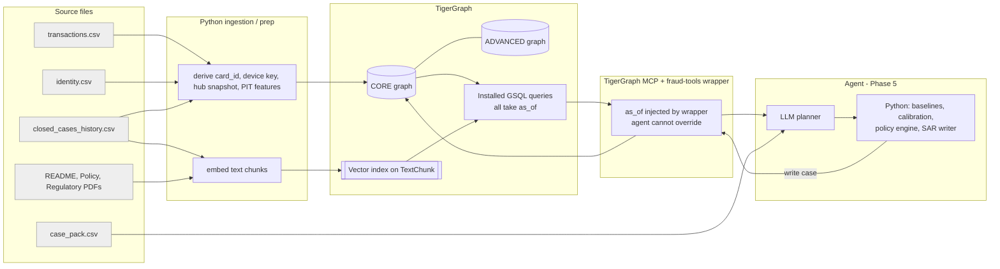
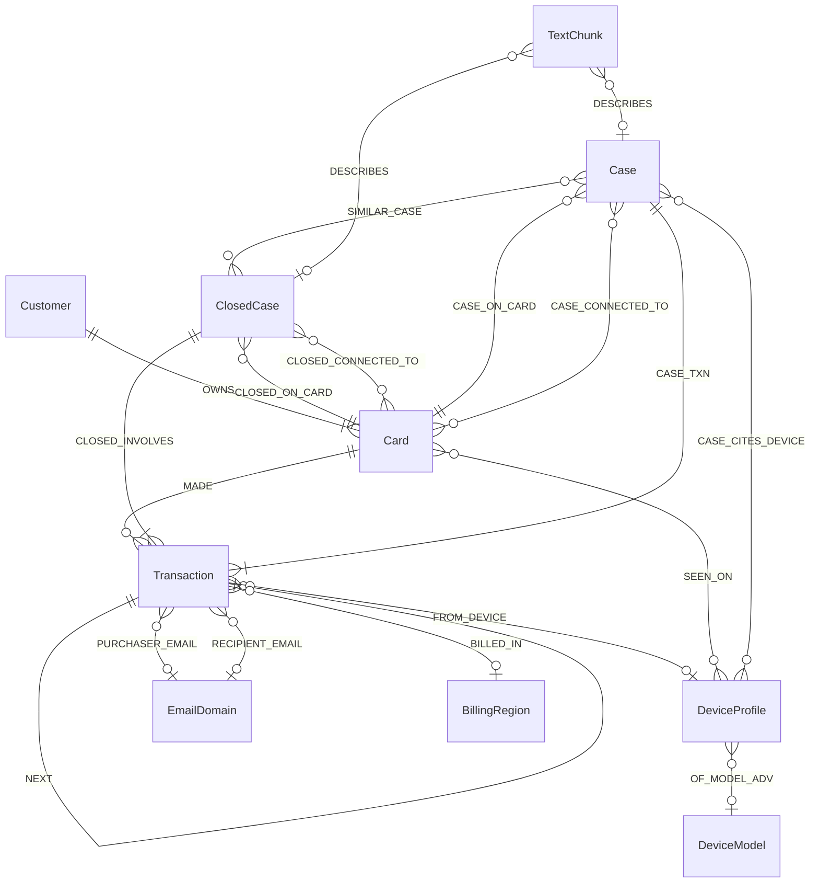

# Graph architecture — Phase 3 (design only)

Source of truth: `DATASET_SPEC.md`, `docs/investigation_findings.md` ("Findings §n"). Nothing here is implemented. TigerGraph-version-dependent syntax is marked **[verify]** and must be checked against the workspace version before Phase 4.

---

## 0. Design drivers (from the findings)

| # | Constraint from the data | Design consequence |
|---|---|---|
| D1 | Cases open after their flagged txn; the file contains the future (up to 1,224 later txns per benchmark customer) | Every read is `as_of`-scoped; time lives on **edges and vertices**, never in pre-aggregated totals (§5) |
| D2 | Labels exist only as closed cases, and become knowable only at `closed_at` | **No label/outcome/pattern property on Transaction.** Labels are reachable only through `ClosedCase` edges filtered by `closed_at ≤ as_of` |
| D3 | `card_id` is not in `transactions.csv`; rule = rank of `card6` (Findings §1, 20/20) | `Card` key is derived in the ingestion step, stored with its raw fields |
| D4 | Risk score is anti-informative at the top and blind to the ring (0 of 60 Nov–Dec ring txns ≥ 0.5; mean 0.14) | `risk_score` stored as a Transaction attribute but **no query uses it as a filter or ranking key**; it is returned as context only |
| D5 | Device sharing is the strongest signal, but only for low-degree, well-formed profiles (Findings §5.3, §6) | `DeviceProfile` is a first-class vertex with quality + hub classification; hubs are traversal-blocked (§6) |
| D6 | Pure "fraud density among sharers" ranks the ring **112th–136th** (validated offline, this phase) — small devices whose few customers all had fraud outrank it | Device evidence is a **compound profile** (new-share, proxy-share, customers, txns/customer, labelled-fraud customers), not one number (§6.3, Q10) |
| D7 | A second cluster is behavioural, not device-based (rotating devices, ProductCD C, $440–500 bursts) | Cross-customer burst scan query (Q13); no invented "ring" vertex in CORE |
| D8 | No merchant, terminal, or account entity exists | None is modelled |

Validation of D6 (offline, this phase, as-of the two earliest ring-relevant cases): among device profiles with ≥ 3 customers and ≥ 3 known device fields, the filter `new_share ≥ 0.9 AND proxy_share ≥ 0.5` returns **2 profiles**; the ring is one (24 customers / 54 txns at 2016-11-12; **44 / 80 at HHG-014's `opened_at`**; 4 customers with closed fraud). The other has 4 customers and no fraud. `risk_score` is not used.

---

## 1. Architecture diagram



Graph schema (CORE = solid, ADVANCED = dashed):



---

## 2. CORE vs ADVANCED

| | CORE (build first; sufficient to discover the ring and answer all 20 cases) | ADVANCED (only after CORE passes acceptance tests, §14) |
|---|---|---|
| Vertices | Customer, Card, Transaction, DeviceProfile, EmailDomain, BillingRegion, ClosedCase, Case, TextChunk | DeviceModel, Document, Cluster (algorithm output) |
| Edges | OWNS, MADE, NEXT, FROM_DEVICE, SEEN_ON, PURCHASER_EMAIL, RECIPIENT_EMAIL, BILLED_IN, CLOSED_ON_CARD, CLOSED_INVOLVES, CLOSED_CONNECTED_TO, CASE_ON_CARD, CASE_TXN (+ flagged variant), CASE_CONNECTED_TO, CASE_CITES_DEVICE, SIMILAR_CASE (Case→ClosedCase), DESCRIBES | OF_MODEL, IN_CLUSTER, SIMILAR_CASE (Case→Case), HAS_CHUNK |
| Transaction props | ids, `epoch`, `ts`, amount, product, channel, risk_score, id_15, proxy, device_type, region/country, `has_identity`, dist, C1/C2/C4/C8/C10, D1–D5/D10/D15, M1–M9, ~9 named V | past-only PIT features, additional C/D, more V |
| Vector | TextChunk.embedding (closed-case notes, policy, pattern text) | Regulatory PDF chunks; Case summaries |
| Algorithms | none (pure GSQL traversal) | WCC/Louvain on Customer–Device projection, node similarity |

Rationale: the ring (Findings §5.1) is a 2-hop pattern (card → device → card) solvable with CORE traversal.

---

## 3. Vertex schema

Types are TigerGraph types. "Time" = static / time-dependent (T) / snapshot (S: computed at 2016-11-01, legal for every case since the earliest `opened_at` is 2016-11-12). "Evidence" = may appear as an evidence item in a case file (**Y**), context/gate only (**C**), never (**N**).

### 3.1 Customer (CORE) — PRIMARY_ID `customer_id STRING`

| Property | Type | Source | Time | Evidence |
|---|---|---|---|---|
| customer_id | STRING | `transactions.customer_id` | static | Y (as ID) |
| card1 | INT | `transactions.card1` | static | N (redundant) |
| n_cards_total | INT | derived | static | C |
| is_mega | BOOL | derived: txns > 1,000 (S) | S | C (baseline granularity switch) |
| first_epoch | INT | min `TransactionDT` | static (valid-from) | C |

Deliberately **not** stored: total txns, total cases, fraud counts (all time-dependent; computed at query time).

### 3.2 Card (CORE) — PRIMARY_ID `card_id STRING` (`C12382-K1`)

| Property | Type | Source | Time | Evidence |
|---|---|---|---|---|
| card_id | STRING | derived: `customer_id + "-K" + rank(card6, NaN first)` | static | Y |
| customer_id | STRING | `transactions.customer_id` | static | Y |
| card_k | INT | rank | static | N |
| card6 | STRING | `transactions.card6` ('' when null) | static | C |
| card4 | STRING | `transactions.card4` (constant per customer) | static | C |
| card2, card3, card5 | DOUBLE | modal value on card | static | C |
| is_null_type | BOOL | card6 null (Findings §1 U1) | static | C |
| first_epoch | INT | min `TransactionDT` on card | static (valid-from) | C |

### 3.3 Transaction (CORE) — PRIMARY_ID `txn_id INT` (`TransactionID`)

| Property | Type | Source CSV.field | Time | Evidence |
|---|---|---|---|---|
| txn_id | INT | transactions.TransactionID | static | Y (ID) |
| epoch | INT | transactions.TransactionDT (seconds since 2016-07-02 00:00:00) | static; **the temporal key** | Y |
| ts | DATETIME | transactions.ts | static | Y |
| amount | DOUBLE | TransactionAmt | static | Y |
| product_cd | STRING | ProductCD | static | Y |
| channel | STRING | channel | static | Y |
| risk_score | FLOAT | risk_score | static | **C** (returned, never filtered/ranked on) |
| card_id, customer_id | STRING | derived / customer_id | static | Y |
| addr1 | INT (−1 null) | addr1 | static | Y (as home/not-home, never as a link) |
| addr2 | INT (−1 null) | addr2 | static | C |
| dist1, dist2 | FLOAT | dist1/dist2 | static | C |
| has_identity | BOOL | join to identity | static | C |
| id_15 | STRING | identity.id_15 | static | Y |
| proxy | STRING | identity.id_23 | static | Y |
| device_type | STRING | identity.DeviceType | static | C |
| id_34 | STRING | identity.id_34 | static | C |
| c1, c2, c4, c8, c10 | FLOAT | C1,C2,C4,C8,C10 | static | Y (as "model feature Cn, meaning unknown") |
| d1, d2, d3, d4, d5, d10, d15 | FLOAT | D1–D5, D10, D15 | static | Y (same caveat) |
| m1…m9 | STRING | M1–M9 | static | Y |
| v51, v52, v79, v93, v94, v217, v258, v264, v308 | FLOAT | V columns named in Findings §2.5 | static | Y (same caveat) |
| p_email, r_email | STRING | P_/R_emaildomain (also as edges) | static | C |

Excluded: `label`, `outcome`, `pattern`, `is_fraud`, any seed marker (`sec0`) (D2, §4 of Findings). Remaining ~330 V/C/D columns live in a Parquet side store keyed by `txn_id` (app-side, ADVANCED).
ADVANCED PIT props (past-only, computed within card ordered by `epoch`, valid for any `as_of ≥ epoch`): `pit_card_hist_n`, `pit_gap_s`, `pit_n1h`, `pit_n48h`, `pit_new_product`, `pit_prior_region_n`, `pit_amt_z`.

### 3.4 DeviceProfile (CORE) — PRIMARY_ID `device_id STRING` (`D_` + first 10 hex of md5(profile_key))

| Property | Type | Source | Time | Evidence |
|---|---|---|---|---|
| device_id | STRING | derived | static | Y (as ID) |
| profile_str | STRING | `DeviceInfo \| id_30 \| id_31 \| id_33`, null → `?` (answer format uses this string; README format) | static | Y |
| device_info, os, browser, screen | STRING | identity.DeviceInfo, id_30, id_31, id_33 | static | C |
| n_known | INT 0–4 | count of non-null fields | static | **gate** |
| is_null_profile | BOOL | n_known = 0 | static | **gate** |
| hub_class | STRING | `NULL` \| `GENERIC` \| `HUB` \| `MID` \| `LOW` \| `UNSEEN` — §6 | **S** (2016-11-01) | **gate, never evidence** |
| n_customers_snap | INT | distinct customers ≤ snapshot | **S** | gate |
| first_epoch | INT | min epoch | static (valid-from) | C |

Live degree, new-share, proxy-share are **not stored**; they are computed as-of in Q5 (§8).

### 3.5 EmailDomain (CORE) — PRIMARY_ID `domain STRING`

| Property | Type | Source | Time | Evidence |
|---|---|---|---|---|
| domain | STRING | union of P_/R_emaildomain | static | C |
| n_customers_snap | INT | **S** | S | gate |
| hub_class | STRING | `GENERIC` (≥ 50 customers) \| `RARE` (< 50) | S | gate |
| is_anonymizer | BOOL | domain = anonymous.com | static | Y (as attribute of a txn, not as a link) |

### 3.6 BillingRegion (CORE) — PRIMARY_ID `addr1 INT`

| Property | Type | Source | Time | Evidence |
|---|---|---|---|---|
| addr1 | INT | transactions.addr1 | static | Y (home vs not) |
| country | INT | modal addr2 | static | C |
| n_customers_snap | INT | S | S | gate |
| hub_class | STRING | `MEGA` (≥ 300) \| `HUB` (100–299) \| `MID` (21–99) \| `LOW` (≤ 20) | S | gate |

### 3.7 ClosedCase (CORE) — PRIMARY_ID `case_id STRING` (`CC-0001`)

| Property | Type | Source (`closed_cases_history.csv`) | Time | Evidence |
|---|---|---|---|---|
| case_id, customer_id, card_id | STRING | same | static | Y |
| opened_at, closed_at | DATETIME | same | **visibility key: visible iff `closed_epoch ≤ as_of`** | Y |
| opened_epoch, closed_epoch | INT | derived (seconds since 2016-07-02) | static | — |
| outcome | STRING | `confirmed_fraud` \| `cleared` | T (visible from closed_at) | Y |
| pattern | STRING | same (7 values) | T | Y |
| n_txns | INT | same | static | Y |
| exposure_usd | DOUBLE | same | static | Y |
| report_filed | BOOL | Yes/No | static | Y |
| actions_taken | STRING | pipe list | static | C |
| first_fraud_txn_id | INT (0 for cleared) | same | static | Y |
| analyst_notes | STRING | same | static | Y (as document evidence via TextChunk) |
| device_text | STRING | regex-extracted from notes (38.9% have one) | static | C |

### 3.8 Case (CORE) — agent-written; PRIMARY_ID `graph_case_id STRING` (`CASE-2016-<nnnn>`)

| Property | Type | Meaning | Time |
|---|---|---|---|
| graph_case_id | STRING | key | static |
| source_case_id | STRING | `HHG-014` or `MON-…` (monitoring) | static |
| **as_of_epoch / as_of** | INT / DATETIME | = the case's `opened_at`. **Memory-visibility key** (§5.5) | static |
| status | STRING | open, closed_fraud, closed_legitimate, escalated | T (revision) |
| verdict | STRING | fraud, legitimate, uncertain | T |
| fraud_probability | DOUBLE | | T |
| pattern, pattern_description | STRING | | T |
| exposure_usd | DOUBLE | | T |
| first_suspicious_txn_id | INT | | T |
| summary | STRING | | T |
| initial_actions, final_actions, what_changed | STRING(JSON) | policy actions with routes | T |
| evidence_json | STRING(JSON) | answer-format evidence list | T |
| sar_file | BOOL | | T |
| stop_reason | STRING | | T |
| revision | INT | increments on update | T |
| created_at / updated_at | DATETIME | wall clock, audit only | audit |
| summary_embedding | LIST<FLOAT> / VECTOR | ADVANCED | |

### 3.9 TextChunk (CORE, GraphRAG) — PRIMARY_ID `chunk_id STRING`

| Property | Type | Source | Time |
|---|---|---|---|
| chunk_id | STRING | `CC-0001#0`, `POLICY#R5`, `PATTERN#3`, `REG:FINCEN-NARR#12` | static |
| doc_type | STRING | `closed_case` \| `policy` \| `pattern` \| `regulatory` \| `case` | static |
| source_ref | STRING | case_id / rule / section / URL | static |
| text | STRING | note text or section | static |
| **valid_from_epoch** | INT | = `closed_at` epoch for closed-case chunks; 0 for policy/pattern/regulatory; case `as_of` for Case chunks | **visibility key** |
| pattern, outcome, channel | STRING | copied from ClosedCase (for pre-filtering) | T |
| embedding | VECTOR(dim, COSINE) **[verify]** | embedding model output | static |

### 3.10 ADVANCED vertices

| Vertex | Key | Properties | Justification |
|---|---|---|---|
| DeviceModel | `model_id` | `model` (e.g. `SM-G935F`), `vendor` | The same handset appears as `SM-G935F Build/NRD90M`, `SAMSUNG SM-G935F Build/NRD90M`, `…/MMB29K` (Findings §5.1, 122 rows). Lets an agent see sibling profiles. Only the exact profile is proven to be the ring |
| Document | `doc_id` | type, title, url, version | Groups regulatory chunks |
| Cluster | `cluster_id` | `algo`, `as_of`, `size`, `created_at` | Written by monitoring mode (WCC / burst scan), never read by case investigations |

---

## 4. Edge schema

All edges are DIRECTED with REVERSE_EDGE unless noted. `epoch` on an edge = the event time; it lets GSQL filter edges without touching the far vertex.

| Edge | From → To | Attributes | Source | Time | Evidence |
|---|---|---|---|---|---|
| OWNS *(rev OWNED_BY)* | Customer → Card | — | derived `card_id` | static | Y |
| MADE *(rev MADE_BY)* | Card → Transaction | `epoch INT`, `amount DOUBLE`, `channel STRING` | `card_id` × txn | T (`epoch`) | Y |
| NEXT | Transaction → Transaction (per card, ordered by `epoch`, ties by txn_id) | `gap_s INT` (past gap only) | derived | T; edge exists at `epoch` of the *later* txn | Y (sequence) |
| FROM_DEVICE *(rev DEVICE_OF)* | Transaction → DeviceProfile | `epoch INT`, `id_15 STRING`, `proxy STRING` | identity.csv | T | Y **only through the eligibility gate** (§6) |
| SEEN_ON *(rev SEEN_BY)* | Card → DeviceProfile | `first_epoch INT` (no `last`, no counter) | derived from FROM_DEVICE | T (visible iff `first_epoch ≤ as_of`) | gate + Y |
| PURCHASER_EMAIL | Transaction → EmailDomain | `epoch` | P_emaildomain | T | C (link never evidence; anonymizer flag is an attribute) |
| RECIPIENT_EMAIL | Transaction → EmailDomain | `epoch` | R_emaildomain | T | C (only `RARE` domains may link, R6) |
| BILLED_IN | Transaction → BillingRegion | `epoch` | addr1 | T | Y only as home/not-home, or `LOW`/`MID` cluster |
| CLOSED_ON_CARD | ClosedCase → Card | — | closed_cases.card_id | visible iff case `closed_epoch ≤ as_of` | Y |
| CLOSED_ON_CUSTOMER | ClosedCase → Customer | — | closed_cases.customer_id | same | Y |
| CLOSED_INVOLVES | ClosedCase → Transaction | `role STRING` (`fraud` \| `alert`), `is_first BOOL` | txn_ids / first_fraud_txn_id | same | Y (label carrier) |
| CLOSED_CONNECTED_TO | ClosedCase → Card | — | connected_card_ids (4 cases, ~96 rows) | same | Y |
| CASE_ON_CARD | Case → Card | — | agent | as_of | Y |
| CASE_TXN | Case → Transaction | `role STRING` (`flagged` \| `affected` \| `first_suspicious`) | agent | as_of | Y |
| CASE_CONNECTED_TO | Case → Card | `via STRING` (device_id/region/…) | agent | as_of | Y |
| CASE_CITES_DEVICE | Case → DeviceProfile | — | agent | as_of | Y |
| SIMILAR_CASE | Case → ClosedCase (CORE), Case → Case (ADVANCED) | `score DOUBLE`, `method STRING` (`vector` \| `structure` \| `both`), `reason STRING` | retrieval | visible iff target visible at `as_of` | context (cited in `similar_prior_cases`, not proof) |
| DESCRIBES | TextChunk → ClosedCase / Case | — | chunker | via chunk `valid_from_epoch` | doc evidence |
| OF_MODEL (ADV) | DeviceProfile → DeviceModel | — | regex on DeviceInfo | static | C |
| IN_CLUSTER (ADV) | Customer/Card/DeviceProfile → Cluster | `score` | algorithm | audit | context |
| HAS_CHUNK (ADV) | Document → TextChunk | `ord INT` | chunker | static | — |

Not modelled (no support in data): merchant, terminal, account, recipient-person, IP address, phone.

### 4.1 Approximate volumes

| Object | Count | | Edge | Count |
|---|---|---|---|---|
| Customer | 13,553 | | OWNS | 14,317 |
| Card | 14,317 | | MADE | 590,742 |
| Transaction | 590,742 | | NEXT | ~576,400 |
| DeviceProfile | ~9,700 | | FROM_DEVICE | 144,432 |
| EmailDomain | ~62 | | SEEN_ON | ≤ 144k (distinct card × device) |
| BillingRegion | 332 | | PURCHASER_EMAIL | ~496k |
| ClosedCase | 5,565 | | RECIPIENT_EMAIL | ~138k |
| TextChunk | ~5,600 closed-case + ~50 policy/pattern (+ regulatory, ADV) | | BILLED_IN | ~525k |
| | | | CLOSED_INVOLVES | 14,955; CLOSED_ON_CARD 5,565; CLOSED_CONNECTED_TO ~96 |
| Total vertices | ~635k | | Total edges | ~2.5M (before reverse) |

Comfortably within a free Savanna workspace.

---

## 5. Temporal model

### 5.1 Time representation
`epoch` = `TransactionDT` (seconds since 2016-07-02 00:00:00; equals `ts` exactly, Spec §8). Every query takes `as_of INT` (same units); the application converts `case.opened_at` → epoch once. Integers avoid DATETIME comparison cost and timezone issues.

### 5.2 Visibility rules (the contract every query obeys)

| Object | Visible at `as_of` iff |
|---|---|
| Transaction, MADE, FROM_DEVICE, BILLED_IN, *_EMAIL, NEXT | `epoch ≤ as_of` |
| SEEN_ON | `first_epoch ≤ as_of` |
| ClosedCase and all its edges/labels/chunks | `closed_epoch ≤ as_of` (stricter than `opened_at`: a case opened before but closed after must not leak its outcome) |
| Agent `Case` and its edges/chunks/SIMILAR_CASE | `case.as_of_epoch ≤ as_of` (**not** wall-clock `created_at`, §5.5) |
| TextChunk policy/pattern/regulatory | always (`valid_from_epoch = 0`) |
| Hub snapshot fields (`hub_class`, `n_customers_snap`) | always visible, but only as an **eligibility gate**, never as evidence |
| Live aggregates (degree, shares, counts, baselines) | never stored; recomputed in GSQL from visible edges |

### 5.3 Rules that make leakage structurally hard
1. **`as_of` is a required parameter** with no default in every installed query.
2. **No mutable aggregates on vertices** (no `n_txns`, `total_amount`, `last_seen`, `fraud_count`). The only stored aggregates are the snapshot gates, computed from data ≤ 2016-11-01, earlier than every case (earliest `opened_at` 2016-11-12) and used only to cap traversal.
3. **Labels not on Transaction** (D2). A confirmed-fraud txn can only be recognised through a visible `ClosedCase`.
4. **Edges carry `epoch`** so filters are cheap and cannot be forgotten by a vertex-level check.
5. **`NEXT` stores backward gap only** (`gap_s` to the previous txn), never a forward reference.
6. **Wrapper injects `as_of`** at the MCP layer (§10): the LLM supplies a case id, not a timestamp.
7. **`leak_check(as_of)`** (Q17) returns `max(epoch)` over everything a tool result touched; the wrapper asserts `≤ as_of` and the test suite runs it on all 20 cases.
8. Unlabeled ≠ legitimate (Findings §4.8): no query treats "no closed case" as a benign label.

### 5.4 Cross-data leakage kept out of the graph
Seed markers (`TransactionDT mod 60 = 0`), original Kaggle labels (not present), and the full V/C/D matrix are excluded from graph attributes. The seed marker may be used **offline** in the evaluation harness to locate the ring/burst rows as a test set (Findings §7), never by the agent.

### 5.5 Agent-written case memory and the evaluation clock
The 20 exam cases are not chronological in ID. The runner must process them in **`opened_at` order** and stamp each `Case` with `as_of_epoch = opened_at`. A later investigation may retrieve an earlier `Case` (visible iff `case.as_of ≤ current as_of`). Never use wall-clock `created_at` for visibility (all 20 cases will be created within minutes). Re-running a case overwrites the same `graph_case_id` (idempotent), incrementing `revision`; retrieval takes the latest revision whose `as_of ≤ current as_of`.
Case memory is context, not label: an `open`/`escalated` Case never counts as confirmed fraud in a later case's base rate.

---

## 6. False-hub strategy

Principle: **a connection is evidence only if it is rare, well-formed, and has anomalous behaviour — never merely because degree is high.** Findings §5.3: device sharing among fraud txns vs baseline is 26–71% vs 1–13% at degree ≤ 20, 79% vs 29% at 21–100, 90% vs 66% at 101–300.

### 6.1 Classification (stored on the vertex; snapshot 2016-11-01; recomputed for later monitoring by versioned snapshot)

| Vertex | Class | Rule | Traversal / evidence |
|---|---|---|---|
| DeviceProfile | `NULL` | all four fields null (`? \| ? \| ? \| ?`, 832 customers Jul–Oct) | **blocked**; never a link |
| | `GENERIC` | `n_known < 3` (e.g. `? \| ? \| mobile safari generic \| ?`) | blocked for linking; still usable as an attribute of the txn |
| | `HUB` | degree ≥ 100 customers (89 profiles) | blocked |
| | `MID` | 21–100 | allowed only with the compound anomaly test (§6.3) |
| | `LOW` | ≤ 20 | allowed |
| | `UNSEEN` | first seen after snapshot | class resolved at query time from as_of degree |
| EmailDomain | `GENERIC` | ≥ 50 customers (43 of 59 P-domains) | attribute only, never a link |
| | `RARE` | < 50 customers | may link for R6 recipient-email rule, still requires anomaly support |
| BillingRegion | `MEGA` / `HUB` | ≥ 300 (38 regions ≥ 300 in Jul–Oct; top 299, 204, 264, 325, 330, 315) / 100–299 | never a link; used only as home vs not-home |
| | `MID` / `LOW` | 21–99 / ≤ 20 | `LOW` region cluster of confirmed fraud (14-day window) is usable; `MID` only with compound support |
| `addr2` | — | 87 = 88% of rows | not a graph vertex; only "≠ 87" as anomaly |
| Customer | `is_mega` (> 1,000 txns) | | baselines must be **card-level**, windowed (e.g. last 180 d) |

### 6.2 Enforcement
- Every neighbour-traversal query (Q4, Q5, Q6, Q9, Q10, Q14, Q15) takes `max_customers` and refuses to expand a vertex whose **snapshot class** is `NULL/GENERIC/HUB/MEGA`, and whose **as_of degree** exceeds `max_customers` (accumulator with early cut-off). Blocked vertices are returned in a `skipped_hubs` list so the agent can say "ignored, degree N" in its evidence.
- Degree is measured **as of `as_of`**, not from the snapshot, whenever a vertex is expanded (snapshot is only the cheap pre-filter).
- The agent's evidence template forbids citing a hub link; the tool never returns hub neighbours as `connected_cards`.

### 6.3 Compound device evidence (what makes the ring findable)
For an eligible device (n_known ≥ 3, ≥ 3 customers, class not blocked) Q5 returns as-of aggregates:

| Metric | Ring at HHG-014 `opened_at` | Why it matters |
|---|---|---|
| customers (as-of) | 44 | MID → needs anomaly support |
| txns per customer | 1.8 | shared by many customers with almost no repeat use |
| `new_share` (`id_15 = New`) | 1.00 | a device is "new" for every account it touches — a genuine returning device would show Found |
| `proxy_share` (`id_23` set) | 1.00 | |
| customers with labelled fraud on it (visible ClosedCase) | 4 | prior fraud on the device |
| mean model score | 0.14 | shown, **not used** |

`device_anomaly_scan` (Q10) applies: `n_known ≥ 3 ∧ customers ≥ 3 ∧ new_share ≥ 0.9 ∧ proxy_share ≥ 0.5`, then reports labelled-fraud customers and the count of *unlabelled* customers on the profile (the potential victims). The offline validation (Section 0) returns 2 profiles; the ring is one. Per-case investigations use the same aggregates for the device on the flagged txn (Q5) — HHG-014's card lands directly on the ring profile. Thresholds are parameters; they must be re-tuned on the Jul–Oct labelled cases, not on the exam.

Non-ring devices that fail this test but have low degree and fraud-customer overlap (e.g. `Z835 … 855x480`: 9 customers, all with fraud) are valid *LOW-degree fraud-history* evidence (Q6) but are not "ring-scale".

---

## 7. Indexes and keys

| Object | Primary key | Secondary access needed | How |
|---|---|---|---|
| Transaction | `txn_id` | by card & time; by device & time | via MADE / FROM_DEVICE edges with `epoch` attribute (no vertex scan) |
| Card | `card_id` | by customer | OWNS |
| Customer | `customer_id` | — | |
| DeviceProfile | `device_id` (hash of normalized profile) | by `profile_str`; by `hub_class` | secondary index on `hub_class`, `profile_str` **[verify: TigerGraph secondary-index support / use an app-side dict]** |
| BillingRegion | `addr1` | | |
| EmailDomain | `domain` | | |
| ClosedCase | `case_id` | by customer/card/device | via edges; optional index on `closed_epoch`, `pattern` **[verify]** |
| Case | `graph_case_id` | by `source_case_id`, `as_of_epoch` | index or app-side map **[verify]** |
| TextChunk | `chunk_id` | vector similarity | vector index (§9) |

Traversal patterns to favour: `Card -(MADE, epoch ≥ a AND ≤ b)-> Transaction`, `DeviceProfile -(SEEN_BY, first_epoch ≤ as_of)-> Card`, `ClosedCase -(CLOSED_INVOLVES)-> Transaction`. Avoid starting from `Transaction` by attribute.

---

## 8. Query catalogue

Implementation classes: **G** = GSQL installed query; **A** = TigerGraph graph algorithm (Graph Data Science library); **V** = vector search / GraphRAG; **P** = application-side Python. Evidence tier refers to Findings §9 hierarchy. All GSQL queries take `as_of INT` (required). `max_customers` default 100.

| # | Query | Class | Inputs | Returns | Notes / evidence tier |
|---|---|---|---|---|---|
| Q0 | `get_case_context` | G+P | `source_case_id` | flagged txn, card, customer, trigger text, `as_of` (from case pack) | The only place `as_of` is set (from `opened_at`). Score returned as context |
| Q1 | `card_history` | G | `card_id, as_of, from_epoch, limit` | txns (id, ts, amount, product, channel, region, device_id, id_15, proxy, score, sec-gap) ordered by `epoch` | Tier 4 (sequence) |
| Q2 | `card_baseline` | G + P | `card_id, as_of, lookback_days=180` | GSQL accumulators: n, span, product histogram, channel mix, region histogram/modal, distinct devices with first_epoch, hour histogram, sum/sumSq/max/min amounts. **P** computes percentiles, z-score, novelty | Tier 4; baseline is card-level (mega-customers) |
| Q3 | `region_novelty` | G | `card_id, txn_id, as_of` | txn region, card's modal region, share of history in region, home-region activity continuing?, foreign flag, `BillingRegion.hub_class` | In-person signal is "≠ home region", not "never seen" (Findings §2.4) |
| Q4 | `device_neighbors` | G | `device_id, as_of, days, max_customers` | other cards/customers on the profile within window, their txn counts, `id_15`, proxy, `skipped_hubs` | Tier 3 only if eligible (§6) |
| Q5 | `device_profile_stats` | G | `device_id, as_of` | as-of customers, txns, txns/customer, `new_share`, `proxy_share`, labelled-fraud customers (visible ClosedCase), unlabeled customers, hub classes, `eligible` flag | Compound evidence (§6.3) |
| Q6 | `low_degree_device_fraud_history` | G | `card_id, as_of, days=30, max_degree=20/100` | for each device the card used: eligible neighbours' visible closed cases (case ids, pattern, outcome) | Tier 2–3 |
| Q7 | `burst_detect` | G | `card_id, as_of, window_s (3600/172800), small_amt=5` | in window: n txns, n < $5 online, follow-up larger purchase, sum, distinct devices/products, total exposure candidate | R5 uses the policy definition; also surfaces the looser history shape (Findings §2.1) |
| Q8 | `prior_cases` | G | `customer_id, card_id, as_of` | visible ClosedCase list (pattern, outcome, exposure, report_filed, notes id), visible agent Cases, repeat-victim counts | Tier 2 (same card/customer) |
| Q9 | `ring_expand` | G | `seed_device_id \| seed_card_id, as_of, days, max_customers, hops≤2` | 1-hop: cards on device; 2-hop: their other eligible devices and closed cases; candidate `connected_card_ids` and `connected_device_profiles`; per-card first/last visible txn on the profile; `skipped_hubs` | Tier 3; feeds `MONITOR_CONNECTED_CARDS` / R6 |
| Q10 | `device_anomaly_scan` | G | `as_of, since_epoch, min_customers=3, min_known=3, new_share≥.9, proxy_share≥.5` | ranked device profiles with Q5 aggregates | Discovery of rings the score misses; also used by autonomous monitoring (Innovation) |
| Q11 | `similar_cases` | G + V + P | features: pattern hypothesis, channel, device_id, region, amount band, text; `as_of, k` | structured candidates (same device / same customer / same card / same pattern+channel) fused with vector hits over TextChunk (§9) | Context only (not evidence) |
| Q12 | `exposure` | G/P | `txn_ids[]` (visible only) | Σ\|amount\|, count, first/last ts | Deterministic; policy §4 |
| Q13 | `cross_customer_burst_scan` | G | `as_of, window_s=3600, min_txns=2, product_cd, amt_lo/hi, min_distinct_devices` | customers/cards with ≥ n txns in a window matching the filter, distinct devices, total | Finds the rotating-device $1.9k family (Findings §5.2, HHG-006) from behaviour only; parameters set from Jul–Oct labelled cases |
| Q14 | `region_cluster` | G | `addr1, as_of, days=14, max_customers` | cards with visible confirmed fraud in region (skips `MEGA/HUB`) | Tier 3 (LOW/MID only) |
| Q15 | `email_link` | G | `domain, as_of, days` | cards using a `RARE` recipient domain in window | R6 recipient rule; no-op for GENERIC |
| Q16a | `upsert_case` | P (MCP write / upsert) | case object | creates/updates `Case` (idempotent on `graph_case_id`, `revision`+1) | Write path |
| Q16b | `link_case` | G | `graph_case_id, txn ids+roles, cards, devices, similar_case ids` | edges CASE_ON_CARD, CASE_TXN, CASE_CONNECTED_TO, CASE_CITES_DEVICE, SIMILAR_CASE | Validates that every referenced ID exists (answer-format rule) |
| Q16c | `find_cases` | G | `device_id \| card_id \| customer_id, as_of` | visible Cases and ClosedCases touching the entity | Case memory lookup |
| Q17 | `leak_check` | G | `as_of, result_ids` | `max_epoch`, list of any object with `epoch > as_of` | Test tool; also run by the wrapper |
| Q18 | `validate_ids` | G | txn/card/customer/device IDs | which do not exist | Enforces "made-up IDs score zero" |

### 8.1 What uses what

| Capability | GSQL | Graph algorithm | Vector / GraphRAG | Python |
|---|---|---|---|---|
| Card history, baseline accumulators, region history, burst windows | ✔ | | | percentiles, z, "customer-typical" logic |
| Device neighbours, degree, hub gating, ring expansion (≤ 2 hops) | ✔ | | | thresholds, evidence wording |
| Prior cases / find cases | ✔ | | | |
| Similar cases | structured half ✔ | ADV: node similarity (Jaccard) on card–device–region sets | text half ✔ | fusion and ranking |
| Case create/update | edge writes ✔ | | | orchestration, JSON, revisions |
| Monitoring mode: ring clusters | | ADV: WCC / Louvain on Customer–DeviceProfile (eligible devices only) | | scheduling, alerting |
| Probability, policy rules R1–R10, next-best-actions, SAR narrative | | | retrieval of policy text | ✔ (deterministic policy engine + LLM narrative) |
| Embeddings | | | ✔ | model calls |

Algorithms are **not** needed to pass CORE: the ring is a 2-hop pattern. Algorithms (WCC/Louvain) appear only in monitoring for the Innovation folder.

### 8.2 GSQL sketches (design-level, not final)

`device_profile_stats` (skeleton):
```gsql
CREATE QUERY device_profile_stats(STRING device_id, INT as_of) FOR GRAPH FraudGraph {
  SumAccum<INT> @@txns; SumAccum<INT> @@new; SumAccum<INT> @@proxy;
  SetAccum<STRING> @@customers, @@fraud_customers;
  D = {DeviceProfile.*}; D = SELECT d FROM D:d WHERE d.device_id == device_id;
  T = SELECT t FROM D:d -(DEVICE_OF:e)-> Transaction:t
      WHERE e.epoch <= as_of
      ACCUM @@txns += 1, @@customers += t.customer_id,
            CASE WHEN e.id_15 == "New" THEN @@new += 1 END,
            CASE WHEN e.proxy != "" THEN @@proxy += 1 END;
  // labelled fraud: only ClosedCase visible at as_of
  CC = SELECT c FROM T:t -(CLOSED_INVOLVES_REV)-> ClosedCase:c
       WHERE c.closed_epoch <= as_of AND c.outcome == "confirmed_fraud"
       ACCUM @@fraud_customers += c.customer_id;
  PRINT @@txns, @@customers.size(), @@new, @@proxy, @@fraud_customers.size();
}
```
`device_neighbors` uses `SEEN_BY` filtered by `first_epoch ≤ as_of` for the cheap card list, then `MADE` with `epoch` window for counts. The early-exit hub guard is `IF @@customers.size() > max_customers THEN BREAK`-style accumulation **[verify]**.

---

## 9. GraphRAG strategy

**What is embedded (`TextChunk`)**

| Doc type | Chunking | Visibility |
|---|---|---|
| Closed-case notes (5,565) | 1 chunk per case (avg 318 chars); metadata: pattern, outcome, channel, extracted `device_text`, exposure band | `valid_from = closed_epoch` |
| Policy (v1.0) | 1 chunk per action, per approval route, per rule R1–R10, §3a, §3b, §4–§7 | always |
| README pattern section | 1 chunk per pattern (5 + "not exhaustive") | always |
| Answer-format notes | evidence/SAR field requirements | always |
| Regulatory PDFs | ~400-token chunks with section headers (**ADVANCED**; links only — must be fetched separately) | always |
| Agent Cases (ADV) | summary + evidence | `as_of` of the case |

**Retrieval (hybrid, temporal, structural-first)**
1. *Structured seeds* (GSQL): same card/customer, same low-degree device, same LOW/MID region → ClosedCase IDs visible at `as_of`.
2. *Vector search*: query built from the case's structured summary (pattern hypothesis, channel, device text, amount band, region novelty), filtered by `valid_from ≤ as_of` and optionally `channel`; top-k (10–20) via TigerGraph vector search **[verify: needs a TigerGraph version with vector attributes; fallback = external FAISS/Chroma holding the same `chunk_id`s, called from Python, with `valid_from` filtering in the application]**.
3. *Graph expansion*: from each hit, follow DESCRIBES → ClosedCase → INVOLVES → Transaction → FROM_DEVICE / BILLED_IN to test whether the hit shares an **eligible** device/region with the current case. Only linked hits become `similar_prior_cases`; text-only hits are labelled "pattern precedent".
4. *Reason with evidence, not text*: closed-case notes are templated (392 distinct normalised notes; pattern is deterministic from structure, Findings §8) — retrieved notes support base rates and wording, never label the new case.
5. *Policy retrieval*: the agent fetches R-rule chunks by rule id (exact), not by similarity, for citations; vector search is used to find the *applicable* rule when unsure.

**Do not**: retrieve by `risk_score` similarity; treat unlabeled txns as negative exemplars; retrieve any chunk with `valid_from > as_of`.

---

## 10. TigerGraph MCP exposure

The open-source TigerGraph MCP server (github.com/tigergraph/tigergraph-mcp) is the transport for schema, loading, query execution, and vertex/edge upserts **[verify tool names and versions at build time]**. We do **not** give the LLM raw read access. Two layers:

```
LLM ──► fraud-tools (thin MCP server / wrapper, holds case → as_of map)
          │  injects as_of, validates ids, runs leak_check, logs tool_calls/tokens
          ▼
      tigergraph-mcp ──► installed GSQL queries (Q0–Q18), vector search, upserts
```

Rationale: (a) the agent cannot pass `as_of` or query arbitrary GSQL; (b) `tool_calls` for the answer file are counted in one place; (c) every result is checked against `as_of`.

### 10.1 Agent-facing tool list

| Tool | Backed by | Read/Write | Notes |
|---|---|---|---|
| `get_case_context(case_id)` | Q0 | R | Sets the session `as_of` |
| `card_history(card_id, hours=48 or from/to)` | Q1 | R | |
| `card_baseline(card_id)` | Q2 (+P) | R | |
| `region_novelty(card_id, txn_id)` | Q3 | R | |
| `device_profile(device_id)` | Q5 | R | returns eligibility + hub reason |
| `device_neighbors(device_id, days=30)` | Q4 | R | hubs skipped and reported |
| `device_fraud_history(card_id)` | Q6 | R | |
| `burst_check(card_id, window)` | Q7 | R | |
| `prior_cases(customer_id, card_id)` | Q8 | R | |
| `expand_ring(seed_device_id \| seed_card_id)` | Q9 | R | |
| `scan_suspicious_devices(params)` | Q10 | R | monitoring/analyst_request use |
| `scan_bursts(params)` | Q13 | R | monitoring |
| `region_cluster(addr1)` | Q14 | R | |
| `similar_cases(summary, features)` | Q11 | R | |
| `retrieve_policy(rule_id \| query)` | vector/exact | R | |
| `exposure(txn_ids)` | Q12 | R | |
| `validate_ids(...)` | Q18 | R | called before writing the answer |
| `write_case(case)` | Q16a+Q16b | **W** | idempotent, revisioned |
| `find_cases(entity)` | Q16c | R | |

**Not exposed to the agent:** free-form GSQL, `leak_check` (runs inside the wrapper), schema/loading tools (dev only), any tool that takes an `as_of` argument.

Operational: read tools are `auto`; `write_case` is the only write and is permitted by policy (`CREATE_CASE` is `auto`). L1/L2 actions are never executed — the agent only records them.

---

## 11. Data ingestion strategy

Stage 1 (Python, offline, deterministic, no LLM): produce **staged CSVs** in `data/staged/` then load via TigerGraph loading jobs (file upload or S3 on Savanna) **[verify]**.

| Step | Output | Logic |
|---|---|---|
| 1. Card map | `card_map.csv` (`customer_id, card6, card_id, card_k`) | rank rule (Findings §1) |
| 2. Device profiles | `device.csv` | key = normalized `DeviceInfo\|id_30\|id_31\|id_33`, nulls `?`; `device_id = D_ + md5[:10]`; `n_known`, `is_null_profile`; keep raw fields and `profile_str` |
| 3. Hub snapshot | `hub_snapshot.csv` | degree (customers) per device / region / email from txns with `ts < 2016-11-01`; classes per §6.1; recompute is a versioned re-run |
| 4. Vertices | customer, card, region, email | as §3 |
| 5. Transaction vertices | `transaction.csv` | column subset, `epoch` = TransactionDT, join `card_id`, `id_15/proxy/device_type` from identity; **no labels** |
| 6. Edges | `owns, made(epoch,amount,channel), next(gap_s), from_device(epoch,id_15,proxy), seen_on(first_epoch), purchaser_email, recipient_email, billed_in` | NEXT sorted by (`card_id`, `epoch`, `txn_id`) |
| 7. Closed cases | `closed_case.csv`, `closed_on_card`, `closed_on_customer`, `closed_involves(role, is_first)`, `closed_connected_to` | `role = fraud` for confirmed cases, `alert` for cleared; `closed_epoch` derived; `device_text` regex |
| 8. Text chunks | `text_chunk.csv` + embeddings | §9; `valid_from = closed_epoch` |
| 9. Case pack | `case_pack` as app-side config (not graph) | `as_of = opened_at`; the pack is input, not memory |
| 10. Side store (ADV) | `txn_features.parquet` | all C/D/V by `txn_id` |

**Loading order:** Customer, Card, Region, Email, Device → Transaction → Ownership/made/next/device/email/region/seen_on edges → ClosedCase → closed edges → TextChunk (+ vectors).

**Verification queries after load (must all pass before Phase 5):**
1. Vertex/edge counts equal §4.1 (Transactions 590,742; Cards 14,317; identity edges 144,432).
2. 20/20 case-pack flagged txns resolve to the case-pack `card_id`; 14,955/14,955 closed-case txns to their `card_id`.
3. `leak_check` on every tool for all 20 `as_of` values.
4. No Transaction has a label property.
5. Ring profile has 114 txns / 52 customers at `as_of = ∞`, 80 / 44 at HHG-014's `as_of`.
6. Hub classes: null profile = `NULL`; 89-ish profiles `HUB`; ring profile not `HUB`.

Idempotency: all loads are upserts keyed by primary IDs; staged CSVs are regenerated, not edited.

---

## 12. What the agent can and cannot conclude from the graph (guard rails)

| Question | Graph answer | Guard |
|---|---|---|
| Is this device shared with fraud? | Q5/Q6 with eligibility | Hubs → "ignored, degree N" |
| Is this region unusual? | Q3 home vs not-home | Region never a link if `MEGA/HUB` |
| Is the txn unusual for the card? | Q2 baseline, card-level | Mega-customer: card + window |
| Is the score high? | returned as context | Never used to rank tools or set probability alone |
| Is this a new device? | `id_15` + first appearance on card | New alone is weak (98% of cleared alerts) |
| Did a similar case exist? | Q11, visible at `as_of` | Precedent ≠ proof |
| What is the exposure? | Q12 | Only txns visible at `as_of` |

---

## 13. Risks and open decisions

| # | Item | Plan |
|---|---|---|
| A1 | Vector attributes require a TigerGraph version supporting them | Confirm on the Savanna workspace; fallback external vector store keyed by `chunk_id` |
| A2 | Secondary index / early-exit accumulator syntax | Verify; app-side maps and staged hub classes already reduce dependence |
| A3 | Snapshot-based hub classes are static; a device may cross thresholds after Nov 1 | Query recomputes as-of degree for expanded vertices; class is only a pre-filter |
| A4 | `profile_str` format vs README example (`SAMSUNG …` prefix variants) | Store raw fields; treat prefixed/unprefixed `DeviceInfo` as separate profiles (README definition); DeviceModel (ADV) bridges variants |
| A5 | K1 = null-`card6` card (Findings U1) | Modeled as its own Card with `is_null_type = true`; investigate before evidence uses it |
| A6 | Whether `connected_card_ids` in 4 undocumented cases equal the ring cards (U2) | Compare in Phase 4 via Q9 |
| A7 | Q10 thresholds (`new_share`, `proxy_share`) fit the ring; overfitting risk | Tune/validate on Jul–Oct labelled clusters; report both parameter values and the false-positive list |
| A8 | Free-workspace performance for mega-cards (14k txns) | Windowed queries (`lookback_days`), edge-attribute filters |
| A9 | Regulatory PDFs are links only | ADVANCED; needs download approval |

## 14. Acceptance tests for CORE (gate before ADVANCED and before the agent)

1. **Card mapping:** 20/20 and 14,955/14,955 (§11).
2. **Leakage:** for each of the 20 cases, all tools return only objects with `epoch ≤ as_of` (Q17 = 0 violations); a deliberately unsafe control query returns > 0.
3. **Ring discovery without score:** at HHG-014's `as_of`, `expand_ring(seed_card = C13487-K1)` returns the ring profile and ≥ 40 other customers; at `as_of` = 2016-11-12, ≥ 20 customers; `device_anomaly_scan` returns the ring in its top 2; zero use of `risk_score` in either query.
4. **Hub suppression:** the null profile and Windows/Chrome-63 generic profile are never returned as neighbours, only listed in `skipped_hubs`.
5. **Label isolation:** cleared closed cases are never returned as fraud evidence; Transaction vertices expose no outcome.
6. **Case memory ordering:** running HHG cases in `opened_at` order, no case retrieves a `Case` with `as_of` later than its own.
7. **Burst scan:** `cross_customer_burst_scan` (parameters set from the Jul–Oct labelled undocumented cases) returns HHG-006's customer at its `as_of`.

STOP: no TigerGraph objects, loaders, queries, or agent code have been created in this phase.
